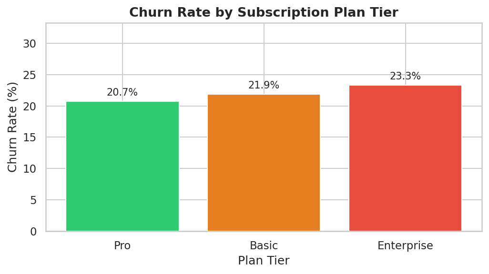
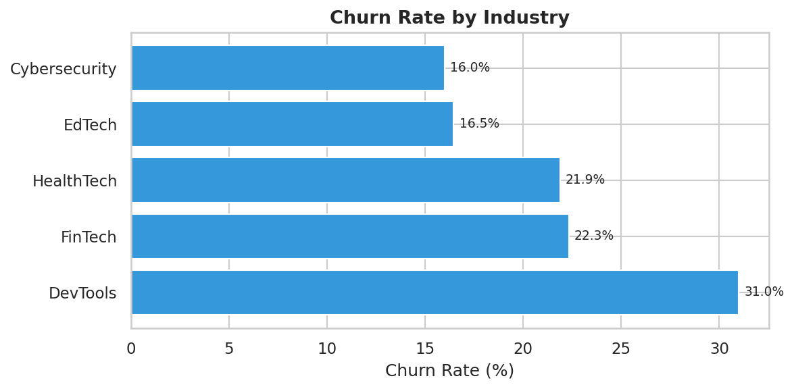
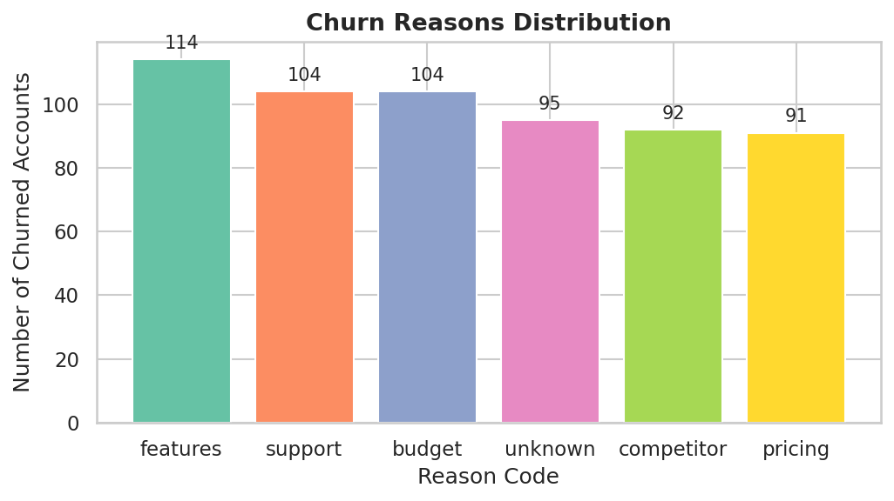
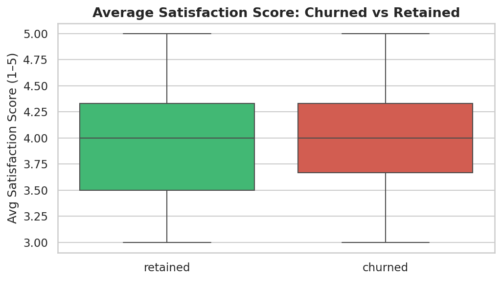
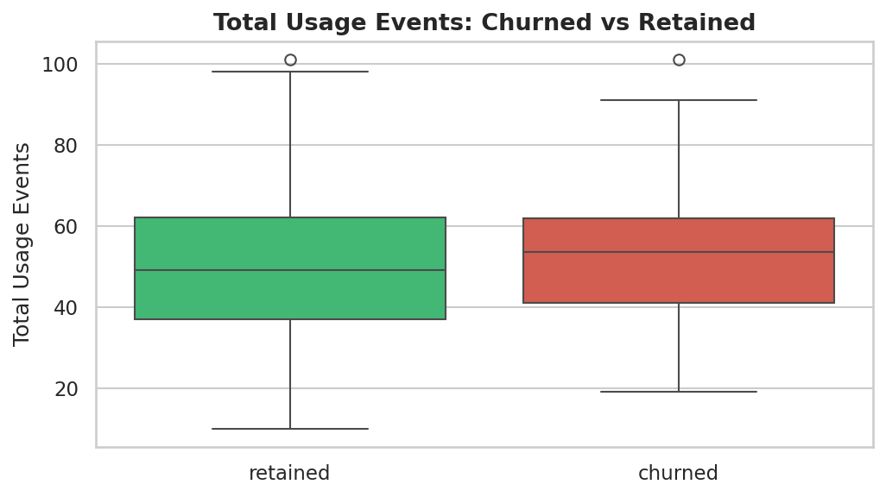
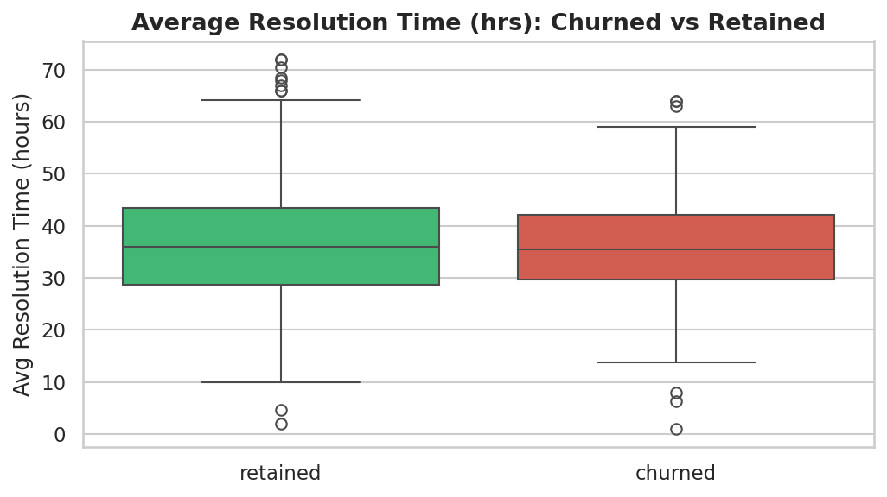
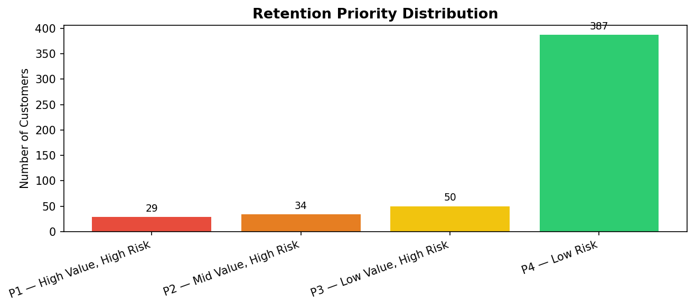
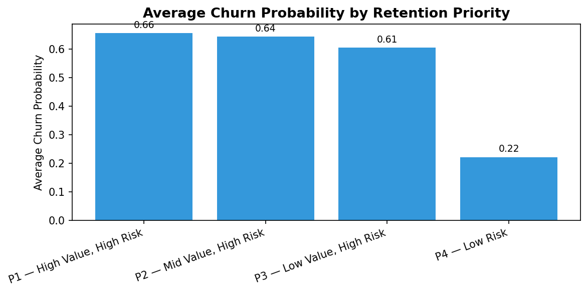
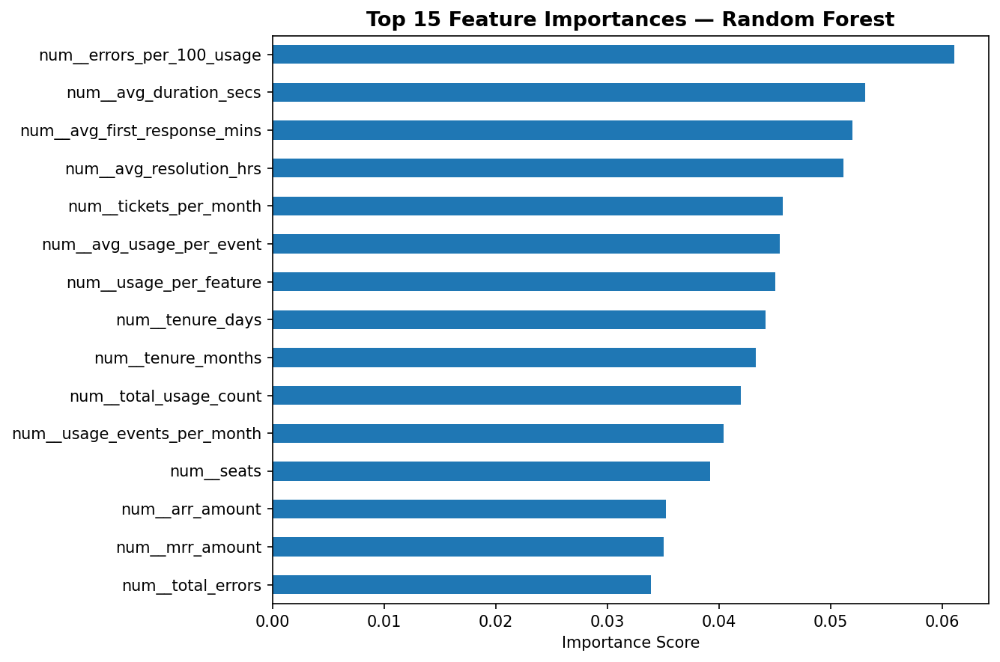
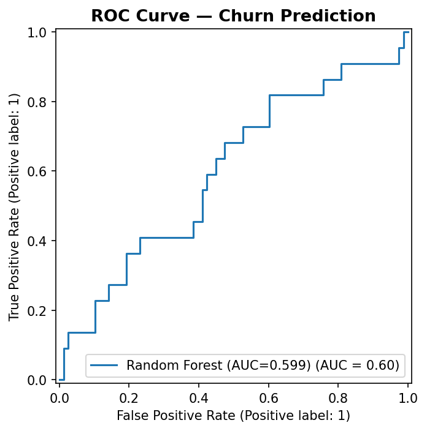

# SaaS Churn & Retention Analytics (RavenStack)

## Project Overview

This project analyzes customer churn for a SaaS company (RavenStack) using SQL, Python, and Machine Learning.

The objective is to:

- Identify key drivers of churn
- Estimate revenue at risk
- Build a churn prediction model
- Recommend actionable retention strategies

---

## Business Problem

Customer churn significantly impacts recurring revenue in SaaS businesses.

This project addresses:

- Which customers are likely to churn?
- What factors influence churn (pricing, support, usage)?
- How much revenue is at risk?
- Which customers should be prioritized for retention?

---

## Tech Stack

- Python (Pandas, NumPy, Matplotlib, Seaborn)
- Machine Learning (Scikit-learn)
- SQL Server (SSMS)
- VS Code

---

## Project Structure

ravenstack-project/
├── data/
├── outputs/
├── assets/
│   └── sql_outputs/
├── src/
│   ├── 01_eda_and_kpis.py
│   ├── 02_segmentation_and_ml.py
├── sql/
│   └── 03_sql_analysis.sql
├── README.md

---

## Key Business Impact

- Predicted revenue at risk: $267,768
- High-value customers at risk: 29
- P1 revenue at risk: $152,376

This shows that a small group of high-value customers contributes a major share of risk and should be prioritized for retention efforts.

---

## Key Insights

### Churn Analysis
- Churn rate is consistent across plan tiers (~22%)
- Higher churn observed in DevTools and FinTech industries

### Revenue Impact
- Significant Monthly Recurring Revenue (MRR) is at risk
- High-value customers contribute a large share of revenue risk

### Support Impact
- SLA breaches are high for urgent and high-priority tickets
- Slower response times correlate with higher churn risk

### Product Usage
- Some features show high usage but also higher error rates
- Indicates potential product quality issues

### Churn Reasons
- Major reasons include:
  - Feature limitations
  - Budget constraints
  - Support issues

---

## Machine Learning Model

### Objective
Predict customer churn probability

### Models Used
- Logistic Regression
- Random Forest (best performing)
- Extra Trees

### Performance
- Best Model: Random Forest
- AUC Score: 0.623

---

## Retention Strategy

Customers are segmented into:

- P1 — High Value, High Risk  
  Immediate intervention such as calls, offers, or account management support

- P2 — Mid Value, High Risk  
  Targeted engagement and follow-up communication

- P3 — Low Value, High Risk  
  Automated campaigns and low-cost retention actions

- P4 — Low Risk  
  Monitoring and upsell opportunities

---

## Python & Machine Learning Outputs

### Churn by Plan Tier

### Churn by Industry

### Churn Reasons

### Satisfaction vs Churn

### Usage Events vs Churn

### Resolution Time vs Churn

### Retention Priority Distribution

### Churn Probability by Priority

### Feature Importance

### ROC Curve

---

## How to Run

### Install dependencies
pip install pandas numpy matplotlib seaborn scikit-learn

### Run analysis
python src/01_eda_and_kpis.py

### Run ML model
python src/02_segmentation_and_ml.py

### Run SQL queries
Execute sql/03_sql_analysis.sql in SQL Server (SSMS)

---

## Key Takeaways

- Churn is driven by product issues, pricing, and support delays
- High-value customers require proactive retention
- Combining SQL, ML, and business logic enables actionable insights

---

## Author

Prateek Prakash